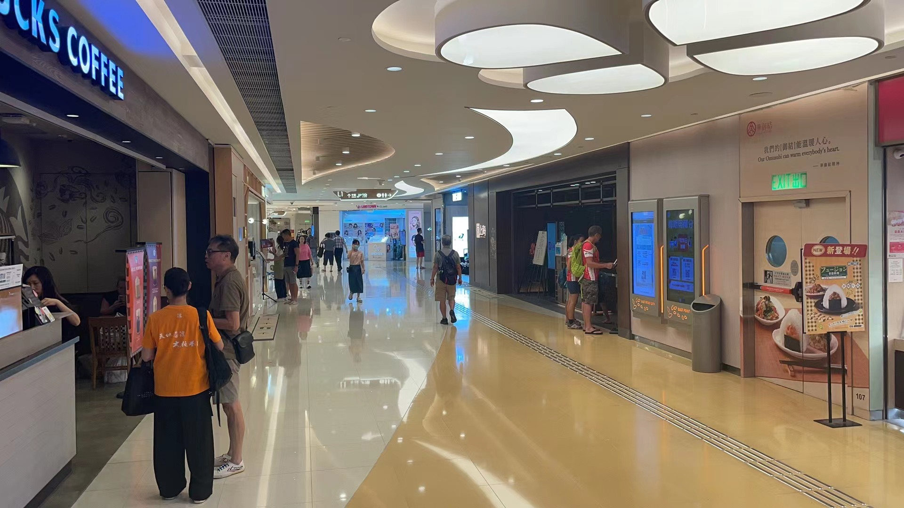

# Activity Sensing
Try to sense the user's activities and identify human heartbeats with ChatGPT! ChatGPT-4 is recommended.
## Overview
1. Shopping mall, Hong Kong: [example-1](#example-1), [example-2](#example-2)

## Example-1

### Scenario:

A shopping mall in Hong kong.
### Sensor Data:
```
1. Step count: 105.0/min.
2. Satellites detected: 0. Carrier-to-noise: 0dB.
3. Total WiFi APs scanned: 12. SSID list: ['__WiFiinnity_Free WiFi HK', 'CSL', '.Wi-Fi. HK via EPCC', 'CSL WiFi Roam', 'HUAWEI-6968', 'hyakunousha-shop', 'jayrich', 'StarbucksHK WiFi', 'Universities via CSL', 'Lens Town By CL Mall Staff', 'hgc on air auto', 'DIMORDER_DO22ASUS5515'].
```
### Full Prompt
```
Objective:
Determine a user's activity by analyzing sensor data from their smartphone.

Background:
Sensor data patterns vary based on the user's activity and environment. These patterns help in inferring the user's activity.

Sensor Data and Expert Knowledge:
You will receive data from various sensors, including the accelerometer, satellite, and WiFi. Here's how to interpret this data:
1. Step Count per Minute:
Source: Accelerometer (measures user's movement).
Interpretation: A high count signifies walking; a low count indicates the user is likely stationary.
2. Satellite Data:
Data: Number of satellites detected and average carrier-to-noise density (in dB).
Interpretation: High satellite count and carrier-to-noise density indicates an outdoor setting with strong satellite signals.
3. WiFi Data:
Data: Total count of WiFi Access Points (APs) detected and the list of their SSID.
Interpretation:
A large total count of detected APs suggests an indoor environment, given the prevalence of WiFi in modern buildings.
Scanned APs indicate user's proximity to them, and their SSIDs can hint at specific locations. So analyze each SSID. For example, a strong signal from an SSID named 'Starbucks' suggests the user is at a Starbucks. Note: Some SSIDs may be not meaningful.

Response Format:
Reasoning: Provide a comprehensive analysis of the sensor data.
Summary: Conclude with a brief summary of your findings.
Motion: choose one from either 'stationary' or 'walking'.
Environment: choose one from either 'indoors' or 'outdoors'.

Reasoning Example:
Sensor Data:
1. Step count: 5/min.
2. Satellites detected: 0. Carrier-to-noise: 0.0dB.
3. Total WiFi APs scanned: 10. SSID list: ['McDonald's Singapore', 'xiaomi_5G', 'McDonald's Singapore'].
Reasoning:
1. The low step count indicates the user is stationary.
2. No detected satellites and low carrier-to-noise suggest an indoor environment.
3. Detected WiFi APs point to an indoor setting, with SSIDs like 'McDonald's Singapore' hinting at a location close to McDonald restaurant in Singapore.
Summary: The user is stationary, likely close to a McDonald restaurant in Singapore.
Motion: stationary.
Environment: indoors.

Now infer a user's motion and surrounding conditions with the following sensor data:
Sensor data:
1. Step count: 105.0/min.
2. Satellites detected: 0. Carrier-to-noise: 0dB.
3. Total WiFi APs scanned: 12. SSID list: ['__WiFiinnity_Free WiFi HK', 'CSL', '.Wi-Fi. HK via EPCC', 'CSL WiFi Roam', 'HUAWEI-6968', 'hyakunousha-shop', 'jayrich', 'StarbucksHK WiFi', 'Universities via CSL', 'Lens Town By CL Mall Staff', 'hgc on air auto', 'DIMORDER_DO22ASUS5515'].
Reasoning:
Summary:
Motion:
Environment:
```
### Response from ChatGPT-4
```
Reasoning:

1. A step count of 105.0/min suggests that the user is walking.
2. No detected satellites and a carrier-to-noise ratio of 0dB indicates an indoor environment.
3. The high count of detected WiFi APs further corroborates the indoor setting hypothesis. The SSIDs provide additional information about the user's location. For instance:
'__WiFiinnity_Free WiFi HK' and '.Wi-Fi. HK via EPCC' suggest the user might be in Hong Kong, given the 'HK' and regional naming conventions.
'StarbucksHK WiFi' indicates proximity to a Starbucks outlet in Hong Kong.
'Universities via CSL' might hint that they are near an educational institution in Hong Kong.
Other SSIDs like 'CSL', 'HUAWEI-6968', and 'Lens Town By CL Mall Staff' further hint at an indoor commercial or urban setting, possibly a shopping mall or a densely populated area with various businesses.

Summary: The user is walking indoors, likely in a commercial or urban setting in Hong Kong, possibly close to a Starbucks and educational institutions.
Motion: walking.
Environment: indoors.
```
ChatGPT [chat link](https://chat.openai.com/share/b2947ce7-ed1f-4e77-8ff5-1ce0cf6afb88).

## Example-2

A shopping mall in Hong kong.
### Sensor Data:
```
1. Step count: 105.0/min.
2. Satellites detected: 0. Carrier-to-noise: 0dB.
3. Total WiFi APs scanned: 22. SSID list: ['.EastPointCity', 'WiFi.HK via EPCC ', '3DG Jewellery', '3HK Pro3 5G', '5G私家寬頻', 'citicall01', 'CSL WiFi-Roam', 'Xiaomi_Home_5G',  '_BW_24g_5g_', 'H158-381_6c49', 'CENTALINE FREE WIFI', 'MiHone', 'SASA_LIVE', '[LG_AirPurifyingFan]bfac', 'Braodway_Freewifi_', 'WiFi.HK via CSL', 'TWIST', 'BW__P2P_', 'Wilsoncomm_G5', 'WTCL', 'Xiaomi_Home', 'SASA_STAFF'].
```
### Full Prompt
```
Objective:
Determine a user's activity by analyzing sensor data from their smartphone.

Background:
Sensor data patterns vary based on the user's activity and environment. These patterns help in inferring the user's activity.

Sensor Data and Expert Knowledge:
You will receive data from various sensors, including the accelerometer, satellite, and WiFi. Here's how to interpret this data:
1. Step Count per Minute:
Source: Accelerometer (measures user's movement).
Interpretation: A high count signifies walking; a low count indicates the user is likely stationary.
2. Satellite Data:
Data: Number of satellites detected and average carrier-to-noise density (in dB).
Interpretation: High satellite count and carrier-to-noise density indicates an outdoor setting with strong satellite signals.
3. WiFi Data:
Data: Total count of WiFi Access Points (APs) detected and the list of their SSID.
Interpretation:
A large total count of detected APs suggests an indoor environment, given the prevalence of WiFi in modern buildings.
Scanned APs indicate user's proximity to them, and their SSIDs can hint at specific locations. So analyze each SSID. For example, a strong signal from an SSID named 'Starbucks' suggests the user is at a Starbucks. Note: Some SSIDs may be not meaningful.

Response Format:
Reasoning: Provide a comprehensive analysis of the sensor data.
Summary: Conclude with a brief summary of your findings.
Motion: choose one from either 'stationary' or 'walking'.
Environment: choose one from either 'indoors' or 'outdoors'.

Reasoning Example:
Sensor Data:
1. Step count: 5/min.
2. Satellites detected: 0. Carrier-to-noise: 0.0dB.
3. Total WiFi APs scanned: 10. SSID list: ['McDonald's Singapore', 'xiaomi_5G', 'McDonald's Singapore'].
Reasoning:
1. The low step count indicates the user is stationary.
2. No detected satellites and low carrier-to-noise suggest an indoor environment.
3. Detected WiFi APs point to an indoor setting, with SSIDs like 'McDonald's Singapore' hinting at a location close to McDonald restaurant in Singapore.
Summary: The user is stationary, likely close to a McDonald restaurant in Singapore.
Motion: stationary.
Environment: indoors.

Now infer a user's motion and surrounding conditions with the following sensor data:
Sensor data:
1. Step count: 105.0/min.
2. Satellites detected: 0. Carrier-to-noise: 0dB.
3. Total WiFi APs scanned: 22. SSID list: ['.EastPointCity', 'WiFi.HK via EPCC ', '3DG Jewellery', '3HK Pro3 5G', '5G私家寬頻', 'citicall01', 'CSL WiFi-Roam', 'Xiaomi_Home_5G',  '_BW_24g_5g_', 'H158-381_6c49', 'CENTALINE FREE WIFI', 'MiHone', 'SASA_LIVE', '[LG_AirPurifyingFan]bfac', 'Braodway_Freewifi_', 'WiFi.HK via CSL', 'TWIST', 'BW__P2P_', 'Wilsoncomm_G5', 'WTCL', 'Xiaomi_Home', 'SASA_STAFF'].
Reasoning:
Summary:
Motion:
Environment:
```
### Response from ChatGPT-4
```
Reasoning:

1. Step count: The high step count of 105/min indicates the user is walking.
2. Satellite data: The absence of detected satellites and a carrier-to-noise ratio of 0dB suggest the user is not in an open outdoor area, or else there would have been some satellite detection. This indicates an indoor setting.
3. WiFi Data:
The high number of WiFi APs (22) scanned suggests a dense indoor environment, potentially a commercial area given the nature of some of the SSIDs.
SSIDs such as '.EastPointCity', '3DG Jewellery', 'CSL WiFi-Roam', 'CENTALINE FREE WIFI', 'SASA_LIVE', 'Braodway_Freewifi_', and 'Wilsoncomm_G5' hint at a shopping center or mall environment.
'.EastPointCity' and 'WiFi.HK via EPCC' suggest a specific location: East Point City, possibly a shopping mall or complex.
The presence of multiple SSIDs associated with known brands and stores further supports the idea of being in a commercial area.

Summary:
The user is walking in an indoor environment, likely within a shopping center or mall, possibly named East Point City.
Motion: walking.
Environment: indoors.
```
ChatGPT [chat link](https://chat.openai.com/share/4cbd359d-6017-4156-8013-5e04c0513c1e).

